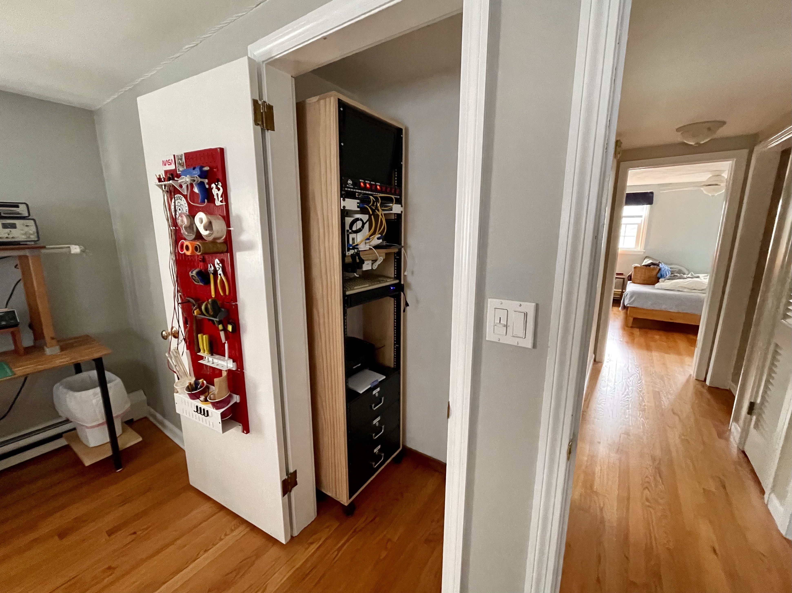
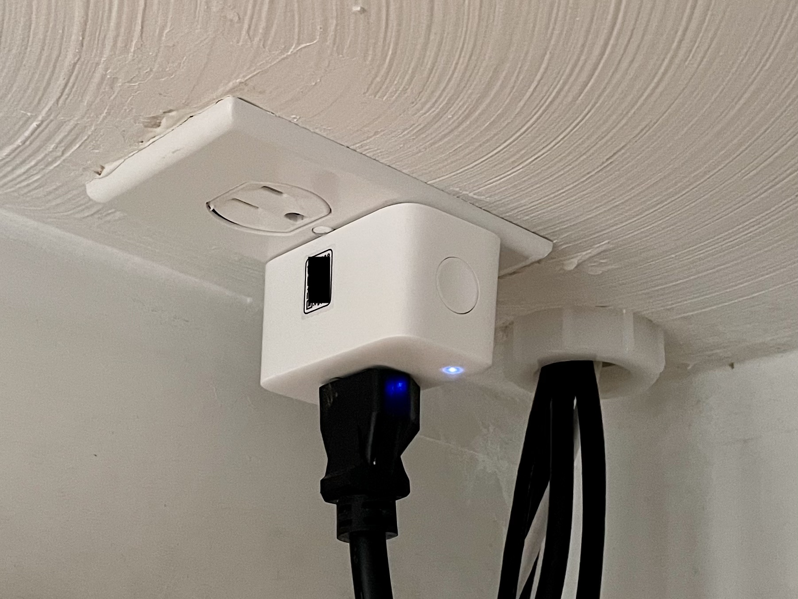
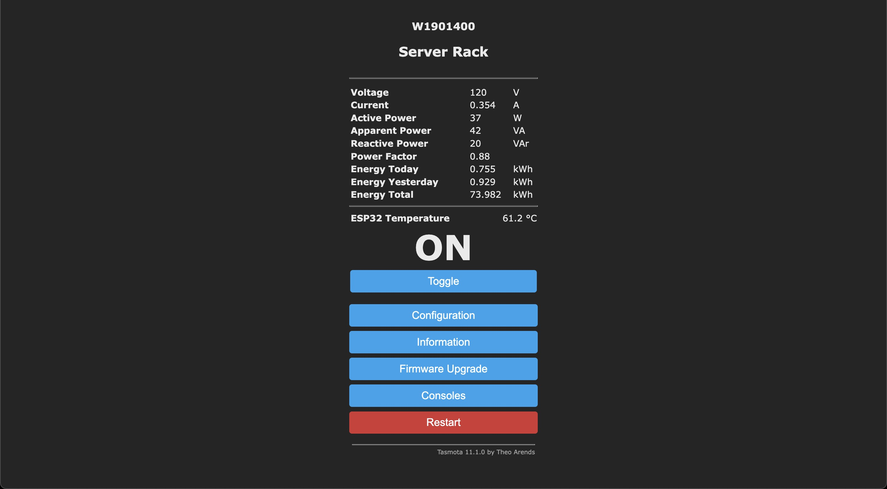
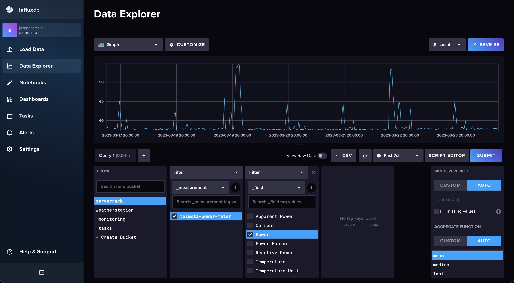

# Tasmota Power Meter InfluxDB Logger

> This project is a containerized Python service that logs data from a Tasmota Power Meter to InfluxDB.

Over the years my home server and networking setup has grown from a single wifi router to an entire equipment rack! Like anyone who pays electric bills I was curious how much power my setup was consuming. I already owned a [KillAWatt Power Meter](https://www.amazon.com/P3-P4400-Electricity-Usage-Monitor/dp/B00009MDBU) and used that to make one-time measurements...but really I was interested in how the power consumption changed over time!



My solution was to purchase a [SwitchBot Plug Mini](https://us.switch-bot.com/collections/all/products/switchbot-plug-mini-homekit-enabled),  a simple wifi switch. I picked this model specifically because it has a built-in power meter that measures the electical load of the connected device. To start I used the official [SwitchBot app](https://apps.apple.com/us/app/switchbot/id1087374760) which is...lacking in features. Specifically there was no way to record power consumption over time - or even any API that would allow me to retrieve that information. 



To get around these limitations I installed [Tasmota](https://tasmota.github.io/docs/). Tasmota is an open-source firmware for common smart devices such as my SwitchBot Plug. The open secret here is that most of these low-cost smart-plugs are just ESP-32 microcontrollers with a relay inside. While the board layout and firmware may be different between brands - they're all *very* similar devices. To replace the stock firmware with Tasmota I followed [these instructions](https://github.com/kendallgoto/switchbota). In summary, you first host the Tasmota firmware payload on a local websever. Then you modify your network DNS so any requests for OTA updates from a SwitchBot device go to your webserver instead. Finally you start the OTA firmware update over bluetooth and the update process runs, installing the firmware you hosted. After a little setup and calibration, your smart plug is now running Tasmota! If you navigate to the local-ip address you can see right away all the power measurements. The final step is to log this information!



Now let's log the data! The Tasmota firmware has a web-request API that allows you to control the device using "commands". These commands are passed as url parameters using http requests. There is a impressive number of commands available, but I only need the [Power Consumption Status Command](https://tasmota.github.io/docs/Commands/#power-monitoring). Each command has an associated number code. To request the power data as json, I used this command. 

```
http://192.168.1.45/cm?cmnd=Status%208
```

The data returned from this command is formated like this:

```json
{
    "StatusSNS": {
        "Time": "2023-03-24T19:35:17",
        "ENERGY": {
            "TotalStartTime": "2023-01-07T16:43:21",
            "Total": 73.984,
            "Yesterday": 0.929,
            "Today": 0.757,
            "Power": 38,
            "ApparentPower": 42,
            "ReactivePower": 19,
            "Factor": 0.89,
            "Voltage": 120,
            "Current": 0.350
        },
        "ESP32": {
            "Temperature": 61.2
        },
        "TempUnit": "C"
    }
}
```

Let log this data! I chose to use InfluxDB to log this data because I already host an instance for other projects - and because I like their data explorer! To log the data I wrote the python logger in `main.py`. After entering the url, bucket and token for my instance of InfluxDB I built this into a Docker container to run on my home sever like this:

```
# Clone this repository
$ git clone https://github.com/josephsamela/tasmota-power-meter-influxdb-logger

# Change into the repository directory
$ cd ./tasmota-power-meter-influxdb-logger

# Build docker image
$ build -t tasmota-power-meter-influxdb-logger .

# Run docker image with name
$ docker run -d --restart=always --name=tasmota-power-meter-logger tasmota-power-meter-influxdb-logger
```

That's it! After waiting a few hours for the data to flow in I started exploring the data! It's comforting to be able see exactly how much power my home server is using - and how much it's costing me! Monitoring this data has allowed me to develop a good sense of my idle power consumption as well as max-power consumption when everything is under load. 


